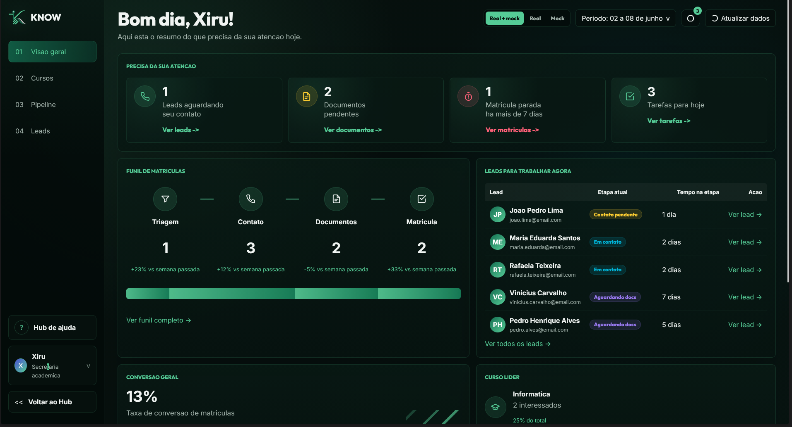
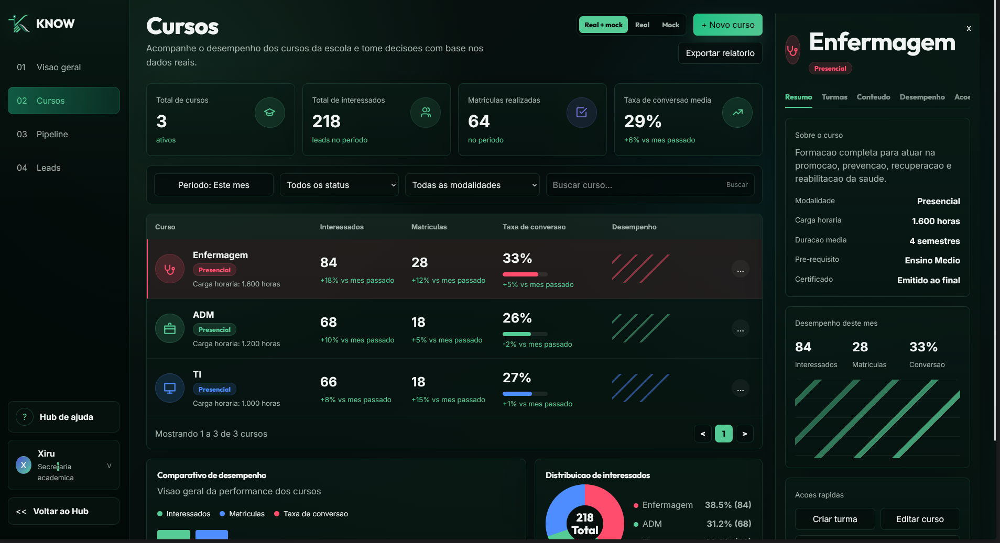
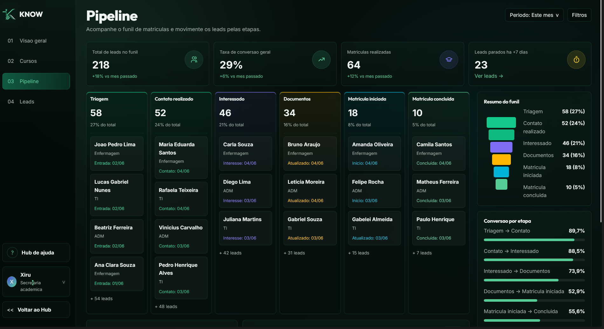
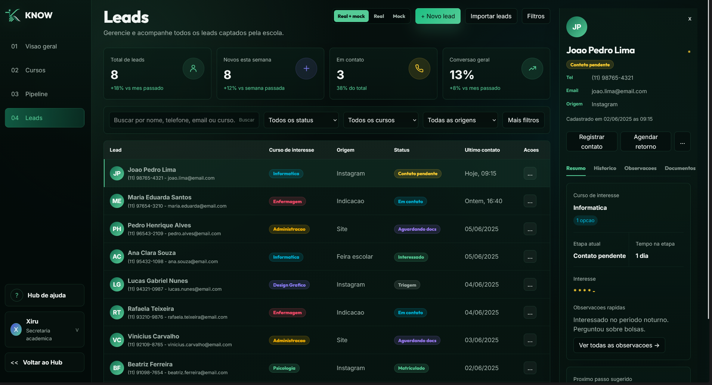

# Colégio Técnico KNOW

Projeto acadêmico de site institucional para uma escola técnica fictícia. A aplicação combina landing page, experiências interativas de captação e um dashboard dedicado da Secretaria para acompanhar leads, cursos e funil de matrículas.

## Preview

### Secretaria - Visão Geral



### Secretaria - Cursos



### Secretaria - Pipeline



### Secretaria - Leads



## Objetivo do Projeto

O projeto demonstra um fluxo completo de captação educacional:

1. O visitante conhece a escola, os cursos, a matriz curricular e as perguntas frequentes.
2. O visitante usa ferramentas do KNOW Hub, como quiz vocacional e raspadinha de eventos.
3. O visitante envia interesse pelo formulário de matrícula.
4. A Secretaria acompanha esses leads em um painel próprio, com métricas, cursos, pipeline e detalhes operacionais.

## Páginas Principais

- `index.html`: site público, com landing page, cursos, FAQ, KNOW Hub e formulário de interesse.
- `secretaria.html`: dashboard administrativo separado do site público, focado na rotina da Secretaria.

## Dashboard da Secretaria

O dashboard possui quatro áreas principais:

- `Visão geral`: saudação do usuário logado, cards de atenção, funil resumido, leads prioritários e indicadores rápidos.
- `Cursos`: desempenho por curso, comparativos, distribuição de interessados e painel lateral com detalhes do curso selecionado.
- `Pipeline`: funil operacional de matrículas, leads por etapa, gargalos e conversão por etapa.
- `Leads`: tabela de leads, filtros, KPIs e painel lateral com resumo do lead selecionado.

O menu inferior da Secretaria possui o atalho `Voltar ao Hub`, que retorna para `index.html#hub`.

## Fonte de Dados

Os leads reais são salvos em `localStorage` usando a chave:

```text
know_leads
```

O dashboard permite alternar entre três fontes:

- `Real`: usa somente leads cadastrados pelo formulário.
- `Mock`: usa dados demonstrativos para apresentação.
- `Real + mock`: combina dados reais e demonstrativos para manter o painel completo mesmo com poucos cadastros reais.

## Módulos JavaScript

- `js/app.js`: inicializa a página pública, navegação, tema, animações, FAQ, KNOW Hub e widgets.
- `js/quiz.js`: controla o quiz vocacional, pontuação por perfil e recomendação final.
- `js/scratchcard.js`: controla a raspadinha, cooldown diário e prêmio associado ao lead.
- `js/leads.js`: valida e salva leads no `localStorage`.
- `js/secretaria-dashboard.js`: controla as telas da Secretaria, fontes de dados, seleção de cursos, pipeline e detalhe de leads.

## Estilos CSS

- `css/variables.css`: tokens de cor, fonte, sombras e temas.
- `css/base.css`: reset visual, tipografia base e componentes globais.
- `css/layout.css`: estrutura da landing page.
- `css/courses.css`: seções e cards relacionados aos cursos no site público.
- `css/widgets.css`: KNOW Hub, quiz, raspadinha e formulário.
- `css/secretaria.css`: layout e componentes do dashboard da Secretaria.

## Como Abrir

Não há build, framework ou servidor obrigatório.

Abra diretamente:

```text
index.html
```

Para acessar o painel da Secretaria:

```text
secretaria.html
```

Também é possível navegar para a Secretaria pelo módulo do Hub no site principal.

## Estrutura de Pastas

```text
.
|-- index.html
|-- secretaria.html
|-- README.md
|-- docs/
|   `-- relatorio-revisao-tech-lead.md
|-- assets/
|   |-- logo-icon.svg
|   |-- logo.svg
|   `-- previews/
|       |-- secretaria-01-overview.png
|       |-- secretaria-02-courses.png
|       |-- secretaria-03-pipeline.png
|       `-- secretaria-04-leads.png
|-- css/
|   |-- variables.css
|   |-- base.css
|   |-- layout.css
|   |-- courses.css
|   |-- widgets.css
|   `-- secretaria.css
`-- js/
    |-- app.js
    |-- quiz.js
    |-- scratchcard.js
    |-- leads.js
    `-- secretaria-dashboard.js
```

## Paleta Principal

- Fundo principal: `#0a0f0d`
- Fundo secundário: `#111a16`
- Verde profundo: `#146E51`
- Verde mint: `#55CB96`
- Texto principal: `#f0f4f2`
- Texto secundário: `#a3b3ac`
- Informática: `#00b4d8`
- Enfermagem: `#ff4d6d`
- Administração: `#ffb703`

## Observação para Apresentação

Este projeto foi construído como um protótipo de alta fidelidade em HTML, CSS e JavaScript puro. A decisão evita dependência de build e facilita a demonstração em contexto acadêmico, mas também significa que módulos grandes, como `secretaria-dashboard.js`, podem ser futuramente divididos em arquivos menores caso o projeto evolua.
