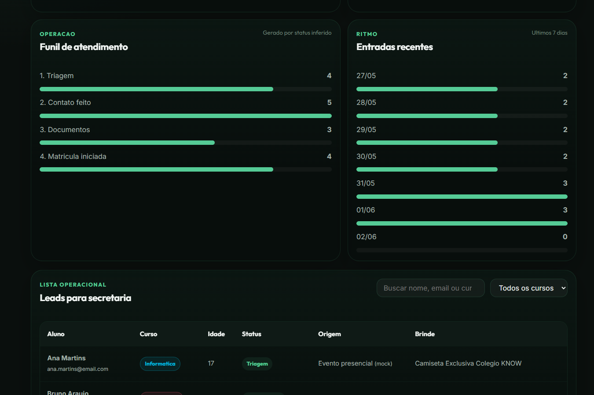
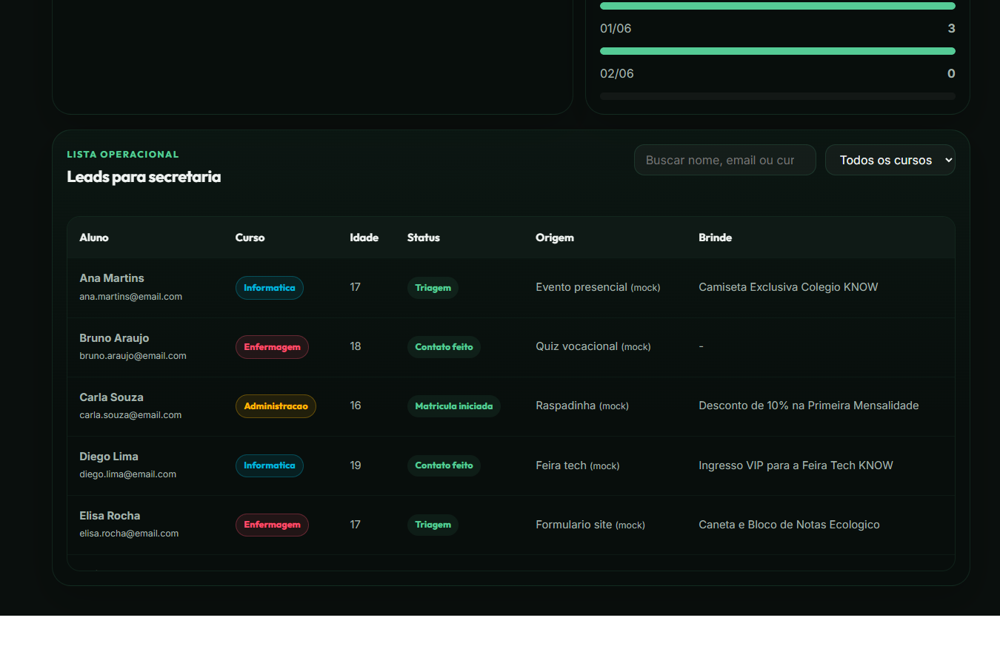

# Colegio Tecnico KNOW

Site institucional para o Colegio Tecnico KNOW, com landing page, apresentacao dos cursos, quiz vocacional, raspadinha promocional, captura de leads e painel dedicado da Secretaria.

## Preview

### Secretaria - Visao Geral


### Secretaria - Pipeline



### Secretaria - Leads



## O que tem no projeto

- Landing page institucional com hero animado e secoes responsivas.
- Matriz curricular com troca de curso sem empurrar o layout de forma brusca.
- FAQ com abertura animada e respostas ocultas corretamente.
- KNOW Hub com experiencia imersiva no scroll.
- Quiz vocacional com recomendacao de curso.
- Raspadinha de eventos com controle de tentativa diaria.
- Formulario de matricula/interesse integrado ao armazenamento local.
- Painel da Secretaria em pagina propria, usando dados reais do formulario e dados mock quando a base real ainda esta pequena.

## Paginas principais

- `index.html` - site principal e KNOW Hub.
- `secretaria.html` - dashboard da Secretaria com metricas, graficos e tabela operacional.

## Como abrir

Nao precisa de build nem servidor. Abra o arquivo `index.html` direto no navegador.

Para testar o painel da Secretaria, abra:

```text
secretaria.html
```

## Fonte de dados da Secretaria

O painel da Secretaria le os leads salvos em `localStorage` pela chave:

```text
know_leads
```

Se houver poucos leads reais, o modo `Form + mock` complementa os graficos com dados demonstrativos. Tambem existem os modos `Somente form` e `Mock`.

## Estrutura

```text
.
|-- index.html
|-- secretaria.html
|-- css/
|   |-- variables.css
|   |-- base.css
|   |-- layout.css
|   |-- courses.css
|   |-- widgets.css
|   |-- admin.css
|   `-- secretaria.css
|-- js/
|   |-- app.js
|   |-- quiz.js
|   |-- scratchcard.js
|   |-- leads.js
|   `-- secretaria-dashboard.js
`-- assets/
    `-- previews/
```

## Paleta principal

- Fundo principal: `#0a0f0d`
- Fundo secundario: `#111a16`
- Verde profundo: `#146E51`
- Verde mint: `#55CB96`
- Texto principal: `#f0f4f2`
- Texto secundario: `#a3b3ac`
- Informatica: `#00b4d8`
- Enfermagem: `#ff4d6d`
- Administracao: `#ffb703`
